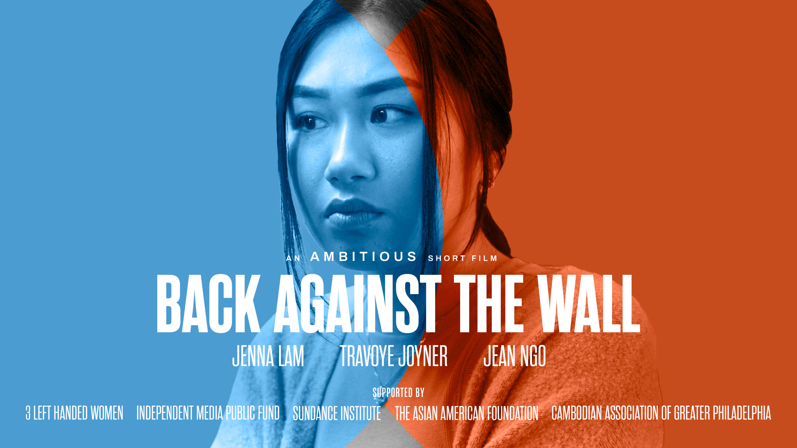
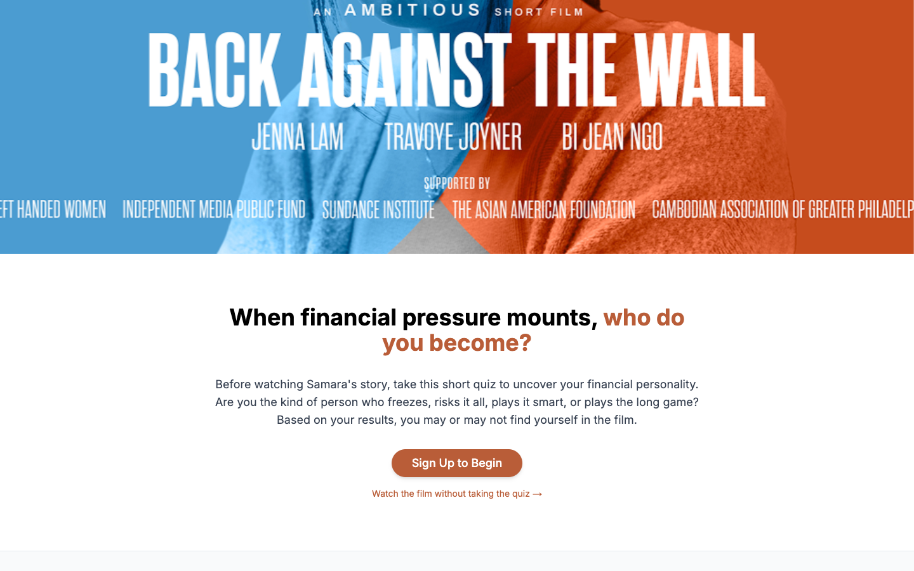
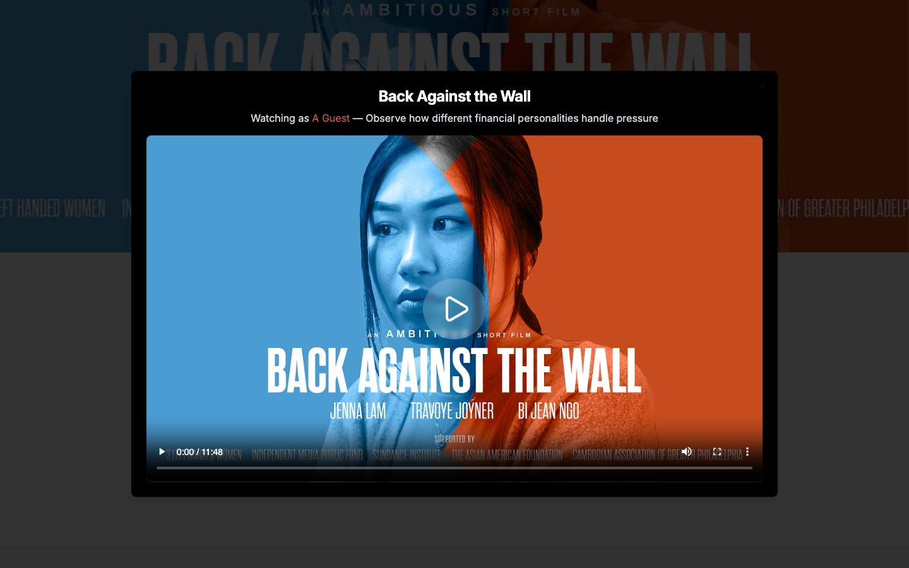

# Back Against the Wall



An interactive web application for the short film "Back Against the Wall" featuring a financial personality quiz that reveals how you handle pressure and financial decisions.

## Live Demo

**[Visit the App](https://backagainstthewall.vercel.app/)**

## About

"Back Against the Wall" is an ambitious short film exploring financial pressure and decision-making. This companion web application allows viewers to:

- Take an interactive quiz to discover their financial personality
- Watch the film through the lens of their archetype
- Explore cast and crew information
- Connect with the film's community

### Financial Archetypes

The quiz identifies one of four financial personality types:

- **The Avoider** - Prioritizes security, minimizes risk
- **The Gambler** - Takes bold risks for potential rewards  
- **The Realist** - Balances caution with calculated opportunities
- **The Architect** - Plans strategically for long-term growth

## Features

- **Interactive Personality Quiz** - Discover your financial archetype
- **Personalized Results** - Detailed analysis with recommendations
- **Film Integration** - Watch the film with archetype-specific insights
- **User Accounts** - Save results and track quiz history
- **Mobile-First Design** - Optimized for all devices
- **Cast & Crew Profiles** - Meet the talented team behind the film
- **Community Features** - Connect with other viewers

## Tech Stack

### Frontend
- **Next.js 14** - React framework with App Router
- **TypeScript** - Type-safe development
- **Tailwind CSS** - Utility-first styling
- **Framer Motion** - Smooth animations
- **Recharts** - Data visualization for results

### Backend & Database
- **MongoDB** - User data and quiz results
- **Sanity CMS** - Content management for film data
- **JWT Authentication** - Secure user sessions
- **Vercel Blob** - Video hosting and optimization

### Development Tools
- **ESLint** - Code linting and quality
- **Prettier** - Code formatting
- **Git LFS** - Large file management
- **Vercel** - Deployment and hosting

## Getting Started

### Prerequisites

- Node.js 18+ 
- pnpm (recommended) or npm
- MongoDB database
- Sanity CMS project

### Installation

1. **Clone the repository**
   ```bash
   git clone https://github.com/traksaw/backAgainstTheWall.git
   cd backAgainstTheWall
   ```

2. **Install dependencies**
   ```bash
   pnpm install
   ```

3. **Environment Setup**
   
   Create `.env.local` with:
   ```env
   # Database
   MONGODB_URI=your_mongodb_connection_string
   
   # Sanity CMS
   NEXT_PUBLIC_SANITY_PROJECT_ID=u6u93177
   NEXT_PUBLIC_SANITY_DATASET=production
   NEXT_PUBLIC_SANITY_API_VERSION=2025-08-10
   
   # Authentication
   JWT_SECRET=your_jwt_secret
   
   # Vercel Blob (for video hosting)
   BLOB_READ_WRITE_TOKEN=your_blob_token
   ```

4. **Run the development server**
   ```bash
   pnpm dev
   ```

5. **Open your browser**
   
   Navigate to [http://localhost:3000](http://localhost:3000)

### Database Setup

The application requires MongoDB collections for:
- `users` - User accounts and authentication
- `quiz_results` - Quiz responses and archetype results
- `quiz_sessions` - Session tracking and analytics

## Screenshots

### Quiz Experience
The interactive quiz guides users through financial scenarios to determine their archetype.



### Personalized Results
Detailed analysis showing personality breakdown with actionable recommendations. Results are tied to a signed-in account — sign up on the [live app](https://backagainstthewall.vercel.app/) to see your archetype breakdown.

### Film Integration
Watch "Back Against the Wall" with insights tailored to your financial personality — or as a guest, without taking the quiz.



## Project Structure

```
├── app/                    # Next.js App Router pages
│   ├── api/               # API routes
│   ├── privacy/           # Privacy policy page
│   ├── terms/             # Terms of service page
│   └── page.tsx           # Home page
├── components/            # React components
│   ├── auth/              # Authentication modals
│   ├── quiz/              # Quiz interface
│   ├── results/           # Results display
│   ├── modals/            # Modal components
│   └── ui/                # Reusable UI components
├── lib/                   # Utility functions
│   ├── quiz/              # Quiz logic and scoring
│   ├── auth.ts            # Authentication helpers
│   └── sanity.ts          # CMS integration
├── hooks/                 # Custom React hooks
├── types/                 # TypeScript definitions
└── sanity/                # Sanity CMS configuration
```

## Development

### Available Scripts

```bash
# Development
pnpm dev          # Start development server
pnpm build        # Build for production
pnpm start        # Start production server

# Code Quality
pnpm lint         # Run ESLint
pnpm type-check   # TypeScript validation

# Database
pnpm db:seed      # Seed database with sample data
```

### Code Style

- **ESLint** configuration for Next.js and TypeScript
- **Prettier** for consistent formatting
- **Mobile-first** responsive design approach
- **Component-driven** architecture

## About the Film

"Back Against the Wall" is an ambitious short film exploring themes of financial pressure, decision-making, and personal growth. The film features:

- **Cast**: Jenna Lam, Travoye Joyner, Bi Jean Ngo
- **Supported by**: 3 Left Handed Women, Independent Media Public Fund, Sundance Institute, The Asian American Foundation, Cambodian Association of Greater Philadelphia

## Contributing

We welcome contributions! Please see our contributing guidelines for details on:

- Code standards and style
- Pull request process
- Issue reporting
- Feature requests

## License

This project is licensed under the MIT License - see the [LICENSE](LICENSE) file for details.

## Acknowledgments

- Sundance Institute for supporting independent filmmaking
- The Asian American Foundation for community support
- All cast, crew, and supporters who made this project possible

## Contact

For questions about the project or film:

- **Website**: [backagainstthewall.vercel.app](https://backagainstthewall.vercel.app/)
- **GitHub**: [traksaw/backAgainstTheWall](https://github.com/traksaw/backAgainstTheWall)

---

*Discover your financial personality. Watch the story unfold.*
